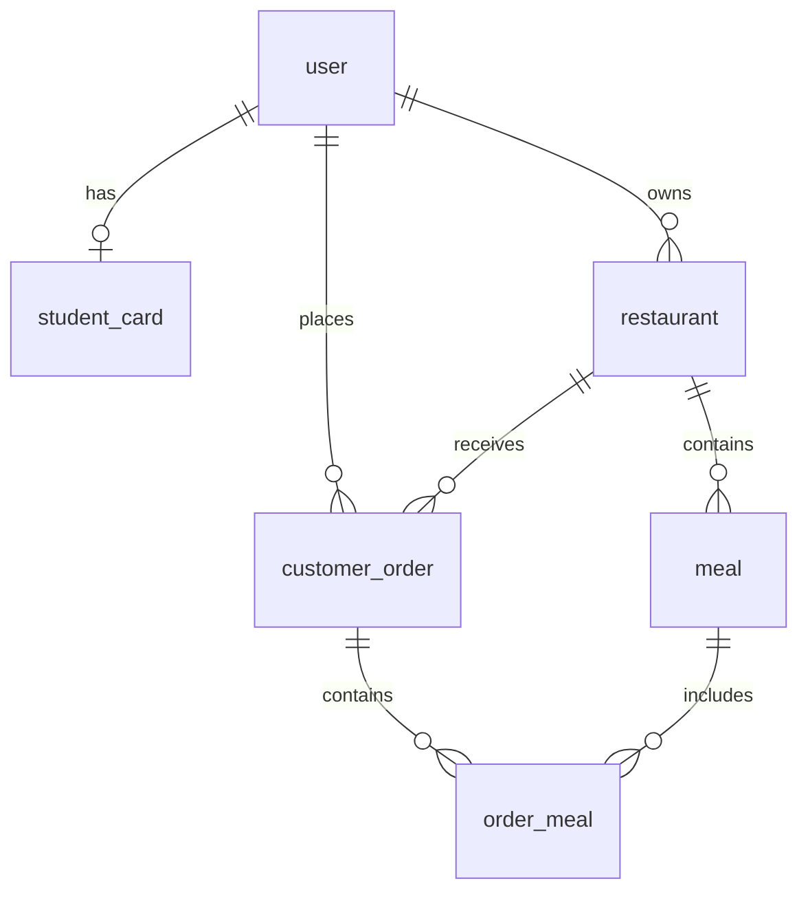

# Personas

## 1. Client

Utilisateur de la plateforme qui consulte les restaurants et passe des commandes.

Un client possède un **type de profil** déterminé par le serveur :

| Type      | Condition                              | Réduction |
|-----------|----------------------------------------|-----------|
| Enfant    | Date de naissance < 18 ans             | 50 %      |
| Étudiant  | Carte étudiante valide enregistrée     | 25 %      |
| Standard  | Par défaut                             | 0 %       |

### Actions

- Consulter la liste des plats d'un restaurant
- Créer une commande avec une liste de plats d'un restaurant
- Consulter l'historique de ses commandes

---

## 2. Restaurateur

Propriétaire d'un restaurant inscrit sur la plateforme. Il gère son menu et suit les commandes reçues.

### Actions

- Créer, modifier et supprimer des plats de son menu
- Consulter les commandes passées pour son restaurant

---

# API REST

## Authentification

Tous les endpoints protégés nécessitent un token JWT dans l'en-tête HTTP :

```
Authorization: Bearer <token>
```

---

## Réponses d'erreur

| Code | Description                                      |
|------|--------------------------------------------------|
| 400  | Requête invalide (payload manquant ou malformé)  |
| 401  | Non authentifié (token manquant ou invalide)     |
| 403  | Non autorisé (accès refusé à la ressource)       |
| 404  | Ressource non trouvée                            |
| 409  | Conflit (ex: email déjà utilisé)                 |

Format de réponse d'erreur :
```json
{
  "error": "string",
  "message": "string"
}
```

---

### `POST /auth/register`

Inscription d'un nouveau compte (client ou restaurateur).

- **Autorisation** : publique
- **Payload** :
```json
{
  "email": "string",
  "password": "string",
  "role": "CLIENT | RESTAURATEUR",
  "name": "string",
  "birthDate": "date"
}
```
- **Réponse** : `201 Created`

> Le statut tarifaire du client est calculé par le serveur : **Enfant** si < 18 ans (basé sur `birthDate`), **Étudiant** si une carte étudiante valide est enregistrée, **Standard** par défaut.

### `POST /auth/login`

Connexion et obtention d'un token JWT.

- **Autorisation** : publique
- **Payload** :
```json
{
  "email": "string",
  "password": "string"
}
```
- **Réponse** : `200 OK`
```json
{
  "token": "string"
}
```

---

## Profil Client

### `POST /clients/me/student-card`

Enregistrement d'une carte étudiante pour bénéficier de la réduction étudiant.

- **Autorisation** : client authentifié
- **Payload** :
```json
{
  "cardNumber": "string",
  "expirationDate": "date"
}
```
- **Réponse** : `201 Created`

> La réduction étudiant (25 %) s'applique tant que la carte est valide (non expirée).

---

## Restaurants

### `POST /restaurants`

Création d'un restaurant.

- **Autorisation** : restaurateur authentifié
- **Payload** :
```json
{
  "name": "string"
}
```
- **Réponse** : `201 Created`

### `GET /restaurants`

Liste des restaurants de la plateforme.

- **Autorisation** : publique
- **Réponse** : `200 OK`
```json
[
  {
    "id": "integer",
    "name": "string"
  }
]
```

### `GET /restaurants/{restaurantId}/meals`

Liste des plats d'un restaurant.

- **Autorisation** : publique
- **Réponse** : `200 OK`
```json
[
  {
    "id": "integer",
    "name": "string",
    "recipe": "string",
    "price": "integer"
  }
]
```

---

## Plats (Restaurateur)

### `POST /restaurants/{restaurantId}/meals`

Création d'un plat dans le menu du restaurant.

- **Autorisation** : restaurateur propriétaire du restaurant
- **Payload** :
```json
{
  "name": "string",
  "recipe": "string",
  "price": "integer"
}
```
- **Réponse** : `201 Created`

### `PUT /restaurants/{restaurantId}/meals/{mealId}`

Modification d'un plat existant.

- **Autorisation** : restaurateur propriétaire du restaurant
- **Payload** :
```json
{
  "name": "string",
  "recipe": "string",
  "price": "integer"
}
```
- **Réponse** : `200 OK`

### `DELETE /restaurants/{restaurantId}/meals/{mealId}`

Suppression d'un plat du menu.

- **Autorisation** : restaurateur propriétaire du restaurant
- **Réponse** : `204 No Content`

---

## Commandes (Client)

### `POST /orders`

Création d'une commande.

- **Autorisation** : client authentifié
- **Payload** :
```json
{
  "restaurantId": "integer",
  "meals": [
    {
      "mealId": "integer",
      "quantity": "integer"
    }
  ]
}
```
- **Réponse** : `201 Created`
```json
{
  "id": "integer",
  "restaurantId": "integer",
  "meals": [
    {
      "mealId": "integer",
      "name": "string",
      "unitPrice": "integer",
      "quantity": "integer"
    }
  ],
  "totalPrice": "integer",
  "appliedDiscount": {
    "type": "PROFILE | LOYALTY_RESTAURANT | LOYALTY_PLATFORM",
    "percentage": "integer"
  },
  "secondMealFree": "boolean"
}
```

### `GET /orders`

Historique des commandes du client.

- **Autorisation** : client authentifié
- **Réponse** : `200 OK`
```json
[
  {
    "id": "integer",
    "restaurantId": "integer",
    "meals": [
      {
        "mealId": "integer",
        "name": "string",
        "unitPrice": "integer",
        "quantity": "integer"
      }
    ],
    "totalPrice": "integer",
    "createdAt": "datetime"
  }
]
```

---

## Commandes (Restaurateur)

### `GET /restaurants/{restaurantId}/orders`

Liste des commandes reçues par le restaurant.

- **Autorisation** : restaurateur propriétaire du restaurant
- **Réponse** : `200 OK`
```json
[
  {
    "id": "integer",
    "clientName": "string",
    "meals": [
      {
        "mealId": "integer",
        "name": "string",
        "unitPrice": "integer",
        "quantity": "integer"
      }
    ],
    "totalPrice": "integer",
    "createdAt": "datetime"
  }
]
```

---

# Modèle Relationnel



> Les prix sont stockés en centimes (integer) pour éviter les erreurs d'arrondi liées aux nombres à virgule flottante.

## user

| Colonne     | Type         | Contraintes                          |
|-------------|--------------|--------------------------------------|
| id          | BIGINT       | PK, auto-increment                   |
| email       | VARCHAR(255) | UNIQUE, NOT NULL                     |
| password    | VARCHAR(255) | NOT NULL                             |
| name        | VARCHAR(255) | NOT NULL                             |
| role        | ENUM         | NOT NULL (`CLIENT`, `RESTAURATEUR`)  |
| birth_date  | DATE         | NOT NULL                             |
| created_at  | TIMESTAMP    | NOT NULL, default NOW                |

## student_card

| Colonne         | Type         | Contraintes                     |
|-----------------|--------------|---------------------------------|
| id              | BIGINT       | PK, auto-increment              |
| user_id         | BIGINT       | FK → user(id), UNIQUE, NOT NULL |
| card_number     | VARCHAR(100) | NOT NULL                        |
| expiration_date | DATE         | NOT NULL                        |

> Relation OneToOne avec `user`. La réduction étudiant s'applique si `expiration_date >= NOW()`.

## restaurant

| Colonne  | Type         | Contraintes                    |
|----------|--------------|--------------------------------|
| id       | BIGINT       | PK, auto-increment             |
| name     | VARCHAR(255) | NOT NULL                       |
| owner_id | BIGINT       | FK → user(id), NOT NULL        |

> Un restaurateur est lié à un seul restaurant. **Évolution future** : permettre à un restaurateur de gérer plusieurs restaurants (relation OneToMany owner → restaurant déjà modélisée via `owner_id` dans `restaurant`).

## meal

| Colonne       | Type         | Contraintes                       |
|---------------|--------------|-----------------------------------|
| id            | BIGINT       | PK, auto-increment                |
| restaurant_id | BIGINT       | FK → restaurant(id), NOT NULL     |
| name          | VARCHAR(255) | NOT NULL                          |
| recipe        | TEXT         | NOT NULL                          |
| price         | INT          | NOT NULL                          |

## customer_order

| Colonne       | Type      | Contraintes                       |
|---------------|-----------|-----------------------------------|
| id            | BIGINT    | PK, auto-increment                |
| customer_id   | BIGINT    | FK → user(id), NOT NULL           |
| restaurant_id | BIGINT    | FK → restaurant(id), NOT NULL     |
| created_at    | TIMESTAMP | NOT NULL, default NOW             |

## order_meal

| Colonne    | Type         | Contraintes                              |
|------------|--------------|------------------------------------------|
| id         | BIGINT       | PK, auto-increment                       |
| order_id   | BIGINT       | FK → customer_order(id), NOT NULL        |
| meal_id    | BIGINT       | FK → meal(id), SET NULL                  |
| meal_name  | VARCHAR(255) | NOT NULL                                 |
| meal_price | INT          | NOT NULL                                 |
| quantity   | INT          | NOT NULL, default 1                      |

> Contrainte unique sur (order_id, meal_id). `meal_name` et `meal_price` sont copiés au moment de la commande pour préserver l'historique (dénormalisation). Si le plat est supprimé ou modifié, les données restent pour garder l'historique.

---

# Évolutions futures — Partie 2

## Fonctionnalité : commande multi-restaurants

> En tant que client, je peux faire une commande qui couvre plusieurs restaurants.

Les points suivants devront évoluer pour supporter cette fonctionnalité :

**Schéma DB**

`customer_order` est remplacé par deux tables :

`order` — session d'achat (une par action client) :

| Colonne     | Type      | Contraintes             |
|-------------|-----------|-------------------------|
| id          | BIGINT    | PK, auto-increment      |
| customer_id | BIGINT    | FK → user(id), NOT NULL |
| created_at  | TIMESTAMP | NOT NULL, default NOW   |

`restaurant_order` — sous-commande par restaurant :

| Colonne       | Type   | Contraintes                      |
|---------------|--------|----------------------------------|
| id            | BIGINT | PK, auto-increment               |
| order_id   | BIGINT | FK → order(id), NOT NULL      |
| restaurant_id | BIGINT | FK → restaurant(id), NOT NULL    |

`order_meal.order_id` devient `FK → restaurant_order(id)` (au lieu de `customer_order`).

**API**
- `POST /orders` : le payload `restaurantId` (unique) devient une liste groupée par restaurant :
```json
{
  "items": [
    {
      "restaurantId": "integer",
      "meals": [{ "mealId": "integer", "quantity": "integer" }]
    }
  ]
}
```
